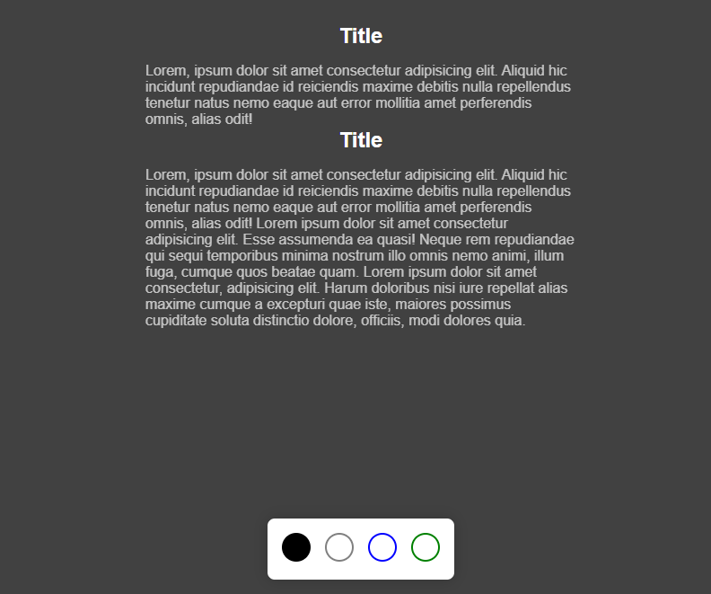
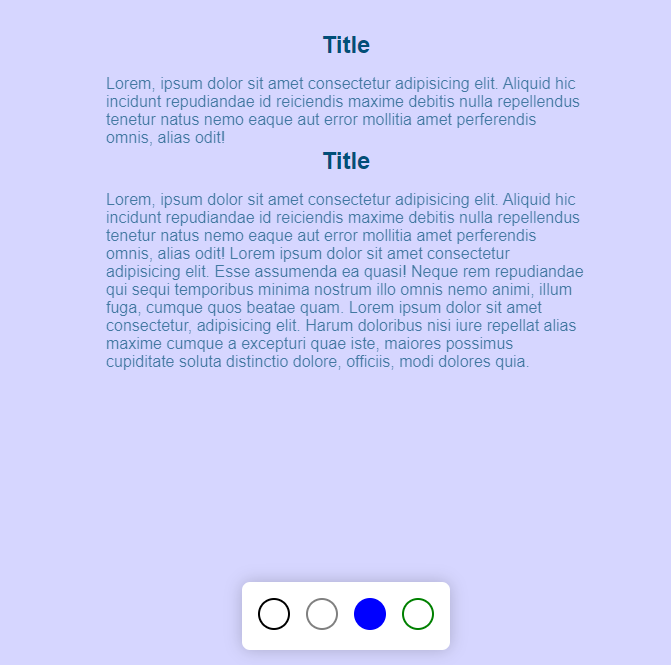

<h1 align="center"> Mudando Tema do Site </h1>

Site feito através de um evento gratuito, promovido pela Rocketseat para ensino de tecnologias WEB.

 

  
  

## 🚀 Tecnologias

Esse projeto foi desenvolvido com as seguintes tecnologias:

- HTML e CSS
- JavaScript                
- Git e Github

## 💻 Projeto

O site tem como intuito demonstrar a possibilidade de incrementar temas diferenciados para visualizar sua página.

## :memo: Licença

---

Feito com ♥ by Rocketseat :wave: [Participe da nossa comunidade!](https://discord.gg/rocketseat)